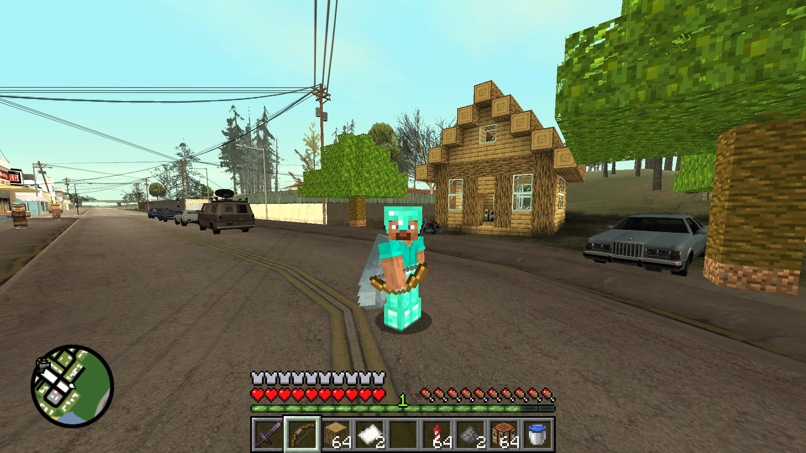

<div align="center">

# GTA SA Minecraft: Minecraft Mod for GTA San Andreas

**Play Minecraft and GTA San Andreas together, in one world.**<br>
Mine and build blocks in Los Santos, craft, survive, fight Creepers and the Warden, and blow holes into the map with TNT. Then jump into a car and drive off with a hotbar full of blocks.


[](https://github.com/muki01/GTA-SA-Minecraft/releases/latest)
[](https://github.com/muki01/GTA-SA-Minecraft/releases)



### [⬇ Download the latest version](https://github.com/muki01/GTA-SA-Minecraft/releases/latest)

</div>

---

## Contents

- [What is GTA SA Minecraft?](#what-is-gta-sa-minecraft)
- [Features](#features)
- [Requirements](#requirements)
- [Installation](#installation)
- [Building from source](#building-from-source)
- [Controls](#controls)
- [Settings](#settings)
- [Project structure](#project-structure)
- [FAQ](#faq)
- [Credits](#credits)
- [Disclaimer](#disclaimer)
- [Türkçe](#türkçe)

## What is GTA SA Minecraft?

**GTA SA Minecraft** is a total crossover mod that brings **Minecraft into Grand Theft Auto: San Andreas**. It is not a texture pack and not a map. It is an **ASI plugin** written in C++ that runs Minecraft's game rules inside the GTA SA engine:

- Minecraft blocks, items, crafting, survival and creative modes.
- Minecraft mobs, mining, sounds and the Minecraft HUD.
- All of it on top of the real GTA world: its streets, cars, people, police and missions.

Break the GTA map itself: roads give blackstone, pavements give stone bricks and grass gives dirt. Dig holes into the ground that cars and pedestrians fall into, or break into buildings and cliffs. Build a house on Grove Street, fight a Creeper in Ganton, or fly over Los Santos with an elytra and fireworks.

The mod uses Minecraft's original textures, sounds, models, recipes and loot tables. The source code here contains no Minecraft files. The textures and sounds the mod needs come packed in the release download.

## Features

### The GTA world becomes a Minecraft world
- **Mine the GTA map.** Every surface gives what it is made of: asphalt, pavement, concrete, rock, grass, sand, mud, glass, metal, trees and bushes.
- **Dig into the ground.** The GTA terrain turns into Minecraft blocks under the surface: dirt, stone and ores, down to bedrock.
- **Break into buildings and cliffs.** The GTA model is cut open where you break it, and blocks lie behind.
- **Cars, pedestrians and street objects can be mined too.** Break a car with a pickaxe for iron, glass and redstone.
- **GTA vehicles and people fall into your holes**, and stand on the blocks you place.
- **TNT blows craters** into the GTA map and its buildings.

### Minecraft gameplay
- **680+ blocks and 390+ items** with their original textures and sounds.
- **Shaped blocks:** stairs, slabs, fences, walls, glass panes, iron bars and beds.
- **Nearly 900 recipes:** crafting table, 2×2 inventory crafting, furnace, smoker and blast furnace.
- **Survival:** health, hunger, saturation, XP and levels, armour, fall damage, drowning and burning.
- **Creative mode:** flying, pick block, and creative tabs laid out and sorted as in Minecraft.
- **Beds:** sleep through the night and set your respawn point.
- **Day and night** follow the GTA clock. Monsters come out in the dark.
- **Minecraft physics** for walking, sprinting, sneaking, jumping and swimming. Water and lava flow; sand and gravel fall; fire spreads.
- **First- and third-person camera,** with the Minecraft player model (Steve) and armour shown on him.
- **Minecraft-style menus:** title screen, world list and pause menu.
- **English or Turkish:** every block and item name, menu, tab, message and death screen switches language. English is the default; pick another language with the **Language...** button, as in Minecraft.

### Mobs and people
- **Animals:** cows, pigs, sheep and chickens. Breed them, shear sheep, milk cows, saddle and ride pigs.
- **Creeper:** it hisses, swells and explodes.
- **Warden:** blind, hears your footsteps, smells you. It has a sonic boom that goes through walls.
- **GTA pedestrians look like villagers** and trade with emeralds.
- **Police and gangs fight with bows and arrows.**

### Combat and items
- **Weapons:** swords with attack charge, critical hits and knockback; bow, crossbow, and a trident that calls lightning in the rain.
- **Throwables and charges:** fire charges, wind charges, snowballs, eggs and ender pearls.
- **Elytra and fireworks,** fishing rod, spyglass, totem of undying, buckets, bone meal, spawn eggs.
- **Mixed with GTA:**
  - A firework strapped to your car works as a rocket boost.
  - Milk clears your wanted level.
  - Body armour shows as golden absorption hearts.
  - The wanted stars sit under the radar.

### Saving
- The Minecraft world is saved **together with your GTA save game**, one world per save slot.

## Requirements

| What | Version |
|------|---------|
| GTA San Andreas (PC) | **1.0 US** executable (`gta_sa.exe`) |
| ASI loader | e.g. Silent's ASI Loader or Ultimate ASI Loader |
| Windows | 10 or 11 |

Minecraft itself is not needed to play.

## Installation

1. You need **GTA San Andreas for PC, version 1.0 US** (`gta_sa.exe`). The Steam and Rockstar Launcher versions must be downgraded to 1.0 first.
2. Install an **ASI loader** into the GTA San Andreas folder, for example Silent's ASI Loader or Ultimate ASI Loader.
3. **[Download the latest release](https://github.com/muki01/GTA-SA-Minecraft/releases/latest)**: `GTA-SA-Minecraft-vX.XX.zip`.
4. Extract the zip into the GTA San Andreas folder: `MinecraftSA.asi` goes next to `gta_sa.exe`, together with the `MinecraftSA` folder.
5. Start the game. The Minecraft title screen appears.
   - The game starts in English. Pick Turkish with the **Language...** button.
   - The settings file `MinecraftSA/MinecraftSA.ini` is written on first start.

The game folder then looks like this:

```
GTA San Andreas/
├── gta_sa.exe                (version 1.0 US)
├── <ASI loader files>
├── MinecraftSA.asi
└── MinecraftSA/
    ├── atlas.png, entity.png, font.png, gui.png, menu.png
    ├── sounds/*.ogg
    ├── OKUBENI.txt           (full guide in Turkish)
    └── MinecraftSA.ini       (written on first start)
```

**Updating:** extract the new release over the old files. Your Minecraft worlds stay.

**Uninstall:** delete `MinecraftSA.asi` and the `MinecraftSA` folder. GTA's own save games are not touched; the Minecraft worlds are stored in `MinecraftSA/world_slotN.dat`.

If something goes wrong, open an issue and attach `MinecraftSA/MinecraftSA.log`.

## Building from source

You only need this to change the mod. The build turns Minecraft's resources into the mod's texture atlases, sounds and game tables. It needs:
- **Visual Studio 2022** with the C++ desktop workload.
- **CMake 3.21+**.
- **Python 3** with `pillow` and `numpy`.
- **Git**.
- The unpacked **Minecraft 26.3** resources: assets and data, including sounds and language files.

```bash
# 1. get the code, with the plugin-sdk submodule
git clone --recursive https://github.com/muki01/GTA-SA-Minecraft.git
cd GTA-SA-Minecraft

# 2. put the unpacked Minecraft 26.3 resources next to the code, as
#    minecraft-assets-26.3/assets/minecraft/...  and  minecraft-assets-26.3/data/minecraft/...

# 3. generate the textures, sounds and game tables
pip install pillow numpy
python tools/gen_assets.py

# 4. build the ASI plugin (32-bit, like the game)
cmake -S . -B build -G "Visual Studio 17 2022" -A Win32
cmake --build build --config Release --target MinecraftSA
```

The result is `build/Release/MinecraftSA.asi`, plus `assets/*.png` and `assets/sounds/*.ogg`, which go into `<GTA folder>/MinecraftSA/`. `build_and_install.bat` builds and copies everything at once; set the `GTA` path at its top first.

**Offline tests:**

```bash
cmake --build build --config Release --target mc_tests
build/Release/mc_tests.exe
```

## Controls

| Key | On foot |
|-----|---------|
| `W` `A` `S` `D` | walk |
| `Space` | jump (double tap in creative: fly) |
| `Left Ctrl` | sprint |
| `Left Shift` | sneak |
| `Left mouse` | attack / mine (hold) |
| `Right mouse` | place block, use item, open chest or crafting table, trade |
| `Middle mouse` | pick block (creative) |
| `1`–`9`, mouse wheel | hotbar |
| `E` | inventory (creative: all items in tabs) |
| `Q` | drop item (`Ctrl+Q`: whole stack) |
| `F` | swap hands |
| `F5` | camera: first person / third person back / third person front |
| `F6` | turn the Minecraft mod on / off |
| `F7` | survival / creative |
| `F8` | CJ / Steve |
| `F9` | GTA radar on / off |

In a car you drive as in GTA. The hotbar, the inventory and right-click items such as food, bow and fireworks still work.

## Settings

`MinecraftSA/MinecraftSA.ini` in the game folder:

| Setting | Meaning |
|---------|---------|
| `Language=en` | language of everything Minecraft says: `en` English, `tr` Turkish (also in the game: **Language...**) |
| `FOV=70` | field of view (0 = GTA's own) |
| `MinecraftControls=1` | Minecraft keys for jump, sprint and sneak |
| `MinecraftPhysics=1` | Minecraft movement physics (0 = GTA's) |
| `ViewBobbing=1` | view bobbing while walking |
| `PedSkins=1` | pedestrians look like villagers |
| `NpcArrows=1` | police and gangs use bows |
| `Animals=1`, `MaxAnimals=14` | animal spawning |
| `Monsters=1`, `MaxMonsters` | monster spawning at night |
| `GroundHoles=1` | dug holes are visible in the GTA ground |
| `BreakBuildings=1` | buildings and cliffs can be broken into |
| `MinecraftMenu=1` | Minecraft-style menus |
| `ShowRadar=1` | GTA radar |

## Project structure

```
src/core/   Minecraft itself: blocks, items, crafting, physics, mobs, combat, HUD layout, block meshes.
            It knows nothing about GTA and is built and tested on its own.
src/gta/    The GTA San Andreas side: engine hooks, rendering, collision, the GTA map turned into blocks.
tools/      gen_assets.py: turns Minecraft's resources into atlases, sounds and generated C++ tables.
tests/      offline tests of the core (mc_tests).
third_party/plugin-sdk   DK22Pac's plugin-sdk (git submodule).
```

The core decides **what** happens and the GTA layer knows **how** to show it in San Andreas. This keeps the Minecraft rules testable without the game.

## FAQ

**Does it work with the Definitive Edition, the Steam version or SA-MP?**
No. It needs the PC version 1.0 US executable, which is what most GTA SA mods require.

**Do I need Minecraft to play?**
No. The release contains everything the mod needs: its packed Minecraft textures and sounds. You need your own GTA San Andreas. No Rockstar files are included.

**Which languages are there?**
English (the default) and Turkish. The names and messages come from Minecraft's own language files. Change the language with the **Language...** button on the title screen or in the pause menu, or with `Language=` in the ini. GTA's own texts, such as missions and its HUD, stay in GTA's language.

**Where do I download it?**
On the [Releases page](https://github.com/muki01/GTA-SA-Minecraft/releases/latest). Extract the zip into the GTA San Andreas folder; see [Installation](#installation).

## Credits

- [plugin-sdk](https://github.com/DK22Pac/plugin-sdk) by DK22Pac and contributors: the GTA SA modding SDK (includes [safetyhook](https://github.com/cursey/safetyhook)).
- [gta-reversed](https://github.com/gta-reversed/gta-reversed): used as a reference for the GTA SA engine.
- Minecraft is by Mojang Studios; Grand Theft Auto: San Andreas is by Rockstar Games.

## Disclaimer

This is a fan-made, non-commercial mod. It is not affiliated with, endorsed by or connected to Mojang Studios, Microsoft, Rockstar Games or Take-Two Interactive. "Minecraft" and "Grand Theft Auto" are trademarks of their respective owners. Minecraft's textures and sounds are © Mojang Studios and are used here for a non-commercial fan project. GTA San Andreas is © Rockstar Games; you need your own copy of the game.

## Türkçe

**GTA SA Minecraft**, GTA San Andreas ile Minecraft'ı tek bir dünyada birleştiren bir moddur (ASI eklentisi).

- GTA haritasını kırıp Minecraft blokları topla: Los Santos'ta ev kur, üretim yap, hayatta kal.
- Creeper ve Warden ile savaş, TNT ile haritada çukur aç.
- Arabana binip hotbar'ındaki bloklarla şehirde dolaş.

Oyun dili İngilizce ya da Türkçe olabilir. Ana menüdeki **Language... / Dil...** düğmesinden seçilir; varsayılan dil İngilizcedir. **İndir:** [son sürüm](https://github.com/muki01/GTA-SA-Minecraft/releases/latest). Zip'i GTA San Andreas klasörüne çıkar, oyunu başlat. Gerekenler: GTA SA 1.0 US ve bir ASI loader. Ayrıntılar yukarıdaki *Installation* bölümünde.

**Anahtar kelimeler:** GTA San Andreas Minecraft modu, GTA SA Minecraft, Minecraft GTA mod, GTA SA mod, Minecraft mod.

---

<div align="center">

If you like the project, please ⭐ **star the repository**. It helps more players find it.

</div>
